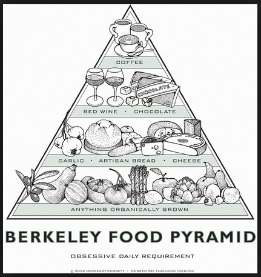

```{r setup, include=FALSE}
knitr::opts_chunk$set(echo = TRUE)
```

```{r, message=FALSE}
library(readr)
library(ggplot2)
library(dplyr)
library(tidyverse)
library(httr)
library(jsonlite)
library(tidyr)
```

```{r pressure, echo=FALSE, fig.cap="Berkeley Food Pyramid", out.width = '50%', out.height = '50%', fig.align='center'}


```
#Introduction and Explanation 

  In this report, we will examine the effects globalization in relation to food on the climate. Taking inspiration from this cute image of the "Berkeley Food Pyramid", found in Peet's Coffee on 4th street, we will examine what it means for cities worldwide to adopt foreign foods as their own. In this example, we can see some products like wine, cheese, and produce, especially garlic, are produced in California and not shipped very far to come to Berkeley. However, other items like coffee and chocolate have to be shipped from countries mainly in the global south, like Colombia, Ethiopia, Vietnam, and Brazil.
  
  Cheap, widely available oil makes it easier to ship all goods, including food, all over the world, rather than engage in locally grown and produced goods. Under longstanding trade agreements, fuel for international freight carried by sea and air is not taxed. However, this convenience comes at a cost to the environment. We are going to examine the trends in US food imports, trends in carbon emissions in the US, as well as global atmospheric CO2 concetrations during the same period.
  
  While there are many contributing factors to climate change, the rise of global CO2 emissions cannot be attributed solely to importing and exporting food. This analysis will hopefully highlight the global interconnectedness in all facets of trade and the way the current world economy drives climate change.
  
  The foods we studied were selected to mirror the "Berkeley Food Pyramid" shown above, to depict this trend in a way that challenges the idea that coffee and chocolate are part of Berkeley's food culture, and to demonstrate that cities worldwide are accustomed to making certain foods part of their culture without mind to the damage to the environment that this practice causes.
  
###Information about the US Food Import Dataset, from the data.gov website
>U.S. consumers demand variety, quality, and convenience in the foods they consume. As Americans have become wealthier and more ethnically diverse, the American food basket reflects a growing share of tropical products, spices, and imported gourmet products. Seasonal and climatic factors drive U.S. imports of popular types of fruits and vegetables and tropical products, such as cocoa and coffee. In addition, a growing share of U.S. imports can be attributed to intra-industry trade, whereby agricultural-processing industries based in the United States carry out certain processing steps offshore and import products at different levels of processing from their subsidiaries in foreign markets.

  This data set provides import values of edible products (food and beverages) entering U.S. ports and their origin of shipment. Data are from the U.S. Department of Commerce, U.S. Census Bureau. Food and beverage import values are compiled by calendar year into food groups corresponding to major commodities or level of processing. At least 10 years of annual data are included, enabling users to track long-term growth patterns.

*Volumes of food below is represented in units of 1000 metric tons.*

```{r, message=FALSE, warning=FALSE}
berkeley_pyramid_imports <- read_csv("Berkeley_Pyramid_Imports.csv")
berkeley_pyramid_imports

```

```{r, message=FALSE}
product_imports <- read_csv("product_imports.csv")
product_imports

```


```{r}
cheese <- filter(product_imports, Product == "Cheese")
vegetables <- filter(product_imports, Product == "Vegetables")
wine <- filter(product_imports, Product == "Wine")
fruit <- filter(product_imports, Product == "Fruit")
cocoa <- filter(product_imports, Product == "Cocoa & chocolate")
wheat <- filter(product_imports, Product == "Wheat")
coffee <- filter(product_imports, Product == "Coffe & tea & spices")
```

```{r, include=FALSE}
ggplot(cheese, aes(Year, Quantity)) + geom_line()

```

```{r, include=FALSE}
ggplot(wine, aes(Year, Quantity)) + geom_line()
 

```

```{r, include=FALSE}
ggplot(vegetables, aes(Year, Quantity)) + geom_line()

```

```{r, include=FALSE}
ggplot(fruit, aes(Year, Quantity)) + geom_line()

```

```{r, include=FALSE}
ggplot(coffee, aes(Year, Quantity)) + geom_line()

```

```{r, include=FALSE}
ggplot(wheat, aes(Year, Quantity)) + geom_line() 

```

```{r}
food_graph <- 
  ggplot(, aes(x = Year)) +
  geom_line(data = cheese, aes(y = Quantity, color = "cheese")) +
  geom_line(data = wine, aes(y = Quantity, color = "wine")) +
  geom_line(data = vegetables, aes(y = Quantity, color = "vegetables")) +
  geom_line(data = fruit, aes(y = Quantity, color = "fruit")) +
  geom_line(data = coffee, aes(y = Quantity, color = "coffee")) +
  geom_line(data = cocoa, aes(y = Quantity, color = "cocoa")) +
  geom_line(data = wheat, aes(y = Quantity, color = "wheat")) +
  scale_color_manual("",
                     breaks = c("cheese", "wine", "vegetables", "fruit", "coffee", "cocoa", "wheat"),
                     values = c("gold", "tan4", "black", "tomato", "forestgreen", "navajowhite", "maroon")) +
  theme_classic() +
  labs(x = "Year", y = "Quantity (1000 metric tons)", title = "Food Imports into the United States")
food_graph
```

We can see in the graph above that the imports of fruit, vegetables, and coffee saw the most dramatic increases in the last 15 years. All of these food products are most commonly grown in the global south, meaning that they must have traveled thousands of miles to reach Berkeley, whether it be by land, sea, or air. Now if we assume that Berkeley saw a fairly average decade during this period compared to the rest of the country, it would make sense that the rest of the west coast - as well as the rest of the United States - experienced a similar increase in imports from the global south. Keep this in mind as we present the carbon dioxide levels both globally and emitted by US transportation below.


###Carbon Dioxide Emissions attributed to Transport in the United States

*Data compiled from [The World Bank](https://data.worldbank.org/indicator/EN.CO2.TRAN.ZS?end=2014&locations=US&start=1999) online database.*

```{r, message=FALSE, warning=FALSE}

test <- GET("http://api.worldbank.org/v2/en/indicator/EN.CO2.TRAN.ZS?downloadformat=csv", 
            write_disk("test.zip", overwrite = TRUE))
  unzip("test.zip")

co2_info <- read_csv("API_EN.CO2.TRAN.ZS_DS2_en_csv_v2_10228633.csv",
                     skip = 4) %>%
  select("Country Name", "1999":"2014") %>%
  slice(250)

table <- co2_info %>%
  gather("Country Name", "Year")

names(table)[1] <- "Date"
names(table)[2] <- "Co2"

table

usplot <- ggplot(table, aes(x = Date, y = Co2, group = 1)) + geom_smooth() + 
  ggtitle("CO2 Emissions from Transport in United States") + 
  ylab("% of CO2 Emissions from Transport") +
  xlab("Year")
usplot
```

According to this graphic, the percentage of carbon dioxide emissions contributed by transportation rose from around 30.5% to almost 34% in the same time period as we saw the increase in imports. This data along with the following global atmospheric carbon dioxide data should paint a correlative picture of rising emissions and climate change.


###Atmospheric Carbon Dioxide Data

*Data sourced from [NASA](https://climate.nasa.gov/vital-signs/carbon-dioxide/)*

```{r, message=FALSE}
co2 <-
readr::read_table("ftp://aftp.cmdl.noaa.gov/products/trends/co2/co2_mm_mlo.txt",
                  comment = "#",
                  col_names = c("year", "month", "decimal_date", "average",
                                "interpolated", "trend", "days"),
                  na = c("-1", "-99.99"))
```


```{r}
berkeley_co2 <- filter(co2, year >= "1999", year <= "2017")
berkeley_co2

```
```{r, message=FALSE}
co2_plot <-
ggplot(berkeley_co2, aes(x = year, y = average)) + geom_smooth() +
  labs( x = "Year", y = "Average Annual CO2 (ppm)", title = "Global CO2 Concentration: 1999-2017") + ylim(300, 450) 
co2_plot
```

###Conclusion

  In conclusion, while we cannot draw any conclusions that the global food market is driving climate change, we believe that there is enough evidence (as presented above) to suggest that it is in fact a contributing factor. To combat this increase, one suggestion is to move towards a more localized diet. This would support local farmers and also has been shown to influence communities towards a healthier, fresher, more sustainable diet.
  
  